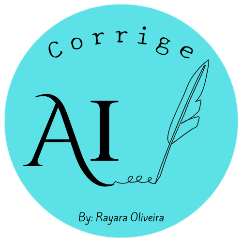
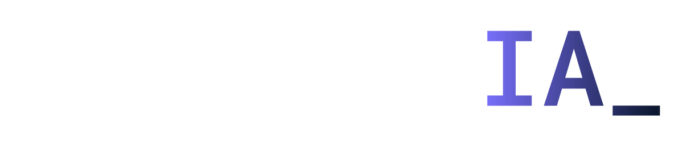

# Corrige AI
### Seu Corretor Automático Inteligente em Qualquer Idioma

**Com o Corrige AI, você pode:**

* Corrigir textos no idioma da sua preferência.
* Correção feita de acordo com a sua necessidade: adapte a sua correção para situações formais e informais.
* Aprimorar sua comunicação escrita com clareza, precisão e fluência.
* Economizar tempo e esforço com um revisor automático sempre disponível.
* Aumentar sua produtividade e profissionalismo na criação de textos.

**O Corrige AI é perfeito para:**

* Estudantes que desejam melhorar suas habilidades de escrita.
* Profissionais que precisam se comunicar com clareza e eficiência no trabalho.
* Pessoas que desejam aprender novos idiomas e escrever com fluência neles.
* Qualquer pessoa que busca melhorar a qualidade de seus textos e se comunicar de forma mais eficaz.

### Tecnologias:

* Gemini: Modelo de linguagem avançado do Google AI.
* Google AI Studio: Plataforma para criação de aplicativos de inteligência artificial.
* API Key do Google Cloud: Permite integrar o Corrige AI a diversos serviços.
* Google Colab: Ambiente de desenvolvimento em nuvem para experimentos com inteligência artificial.

### Benefícios:

* **Correção automática em vários idiomas:** Suporta uma ampla gama de idiomas, permitindo que você corrija textos em sua língua nativa ou em qualquer outra que desejar.
* **Adaptação ao tom formal ou informal:** Identifica o tom da escrita e ajusta as sugestões de correção de acordo com o contexto, seja para um ambiente profissional ou casual, adequando-se à situação.
* **Tecnologia Gemini avançada:** Utiliza o modelo de linguagem Gemini, conhecido por sua precisão e fluência na geração de texto em diversos idiomas.
* **Desenvolvido com ferramentas do Google:** Combina ferramentas poderosas do Google para oferecer uma experiência robusta e confiável.

*Projeto desenvolvido por Rayara Vitória Oliveira de Pinho, durante a imersão de IA da Alura e do Google*

